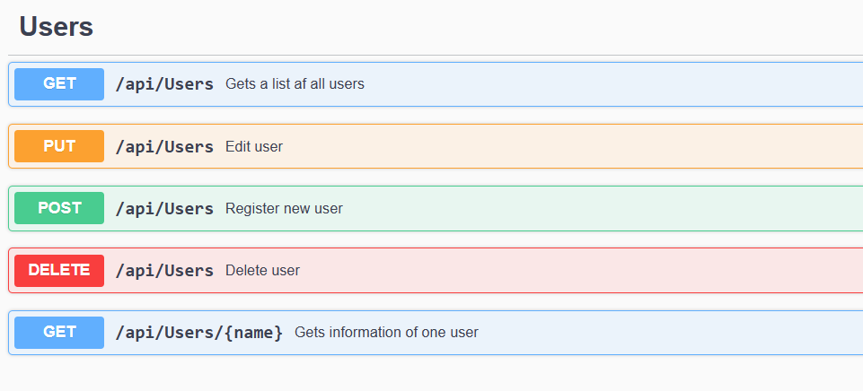
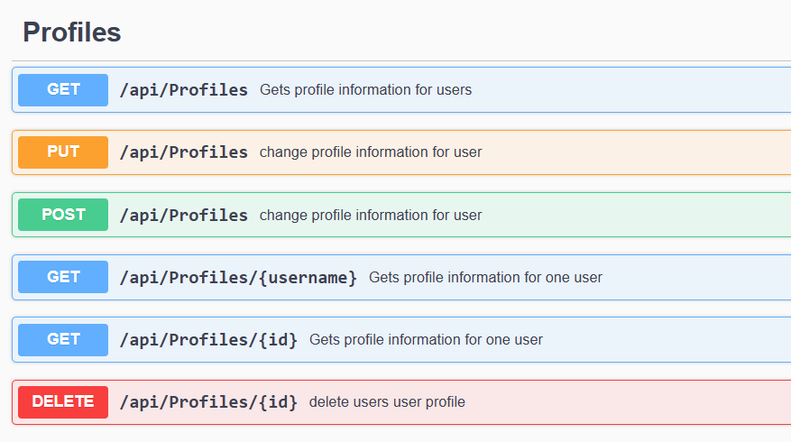
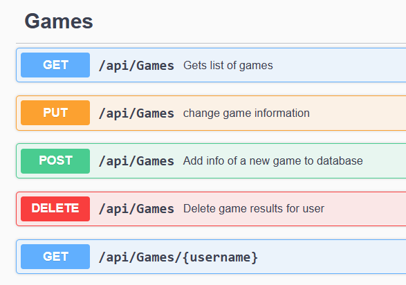
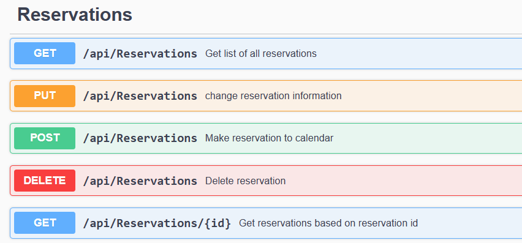
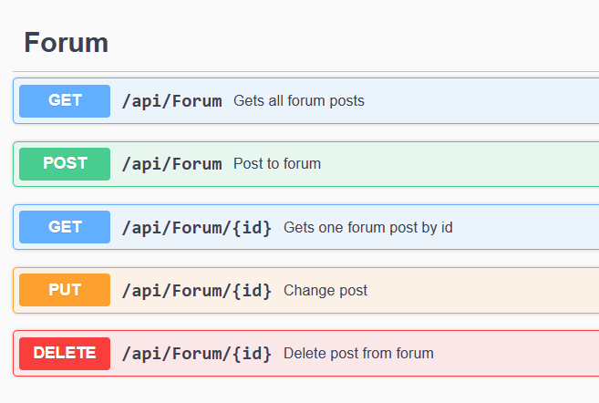

# Projekti2BackEnd

Tämä on padel aiheisen verkkosivuston back-end.
Tämä Asp.Net projekti on kirjoitettu C#-lla.
Tämän rajapinnan avulla pystytään tietoturvallisesti siirtämään käyttäjien rekisteröintitiedot Azuren palvelimella toimivaan SQL-tietokantaan.

Tietokannasta pystytään hakemaan padel-pelaajien profiilitietoja, tietoja pelikenttävarauksista sekä käyttämään verkkosivun keskustelupalstaa peliseuran etsimiseen.
Rajapinta vastaa verkkosivulta tuleviin HTTP kyselyihin ja hakee niiden perusteella tietokannasta vaaditut tiedot, tai muokkaa tietokantaa tehdyn pyynnön mukaisesti.

Rajapinnan ominaisuudet ja funkitiot dokumentoidaan swaggerin avulla.

Api toimii Azure alustalla samoin kuin sen käyttämä tietokanta.
Rajapinta kutsut tehdään osoitteeseen:
https://padel-kaveritapi.azurewebsites.net/api/

User controllerin funktiot:

Profiles controllerin funkitiot:

Games controllerin funkitiot:

Reservations controllerin funkitiot:

Forum controllerin funkitiot:

Tämän upean koodin ovat luoneet Minna Siivo ja Aurora Särkkä projektityö 2 -kurssilla.
